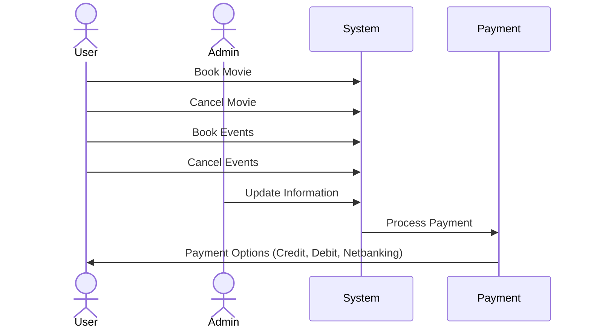
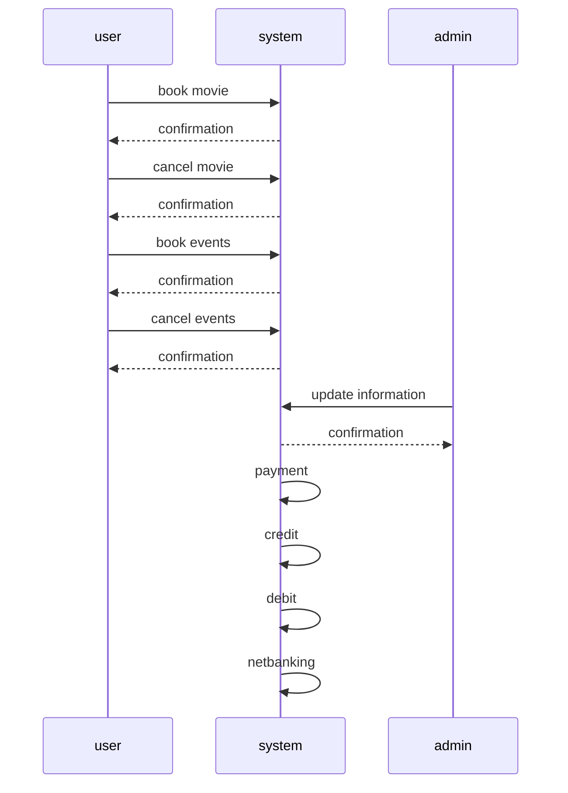

# Hello


```mermaid
 sequenceDiagram
     actor Actor
 ```
```plantuml
@startuml
actor User
actor Admin

User -> (Book Movie)
User -> (Cancel Movie)
User -> (Book Events)
User -> (Cancel Events)

Admin -> (Update Information)

(Book Movie) --> (System)
(Cancel Movie) --> (System)
(Book Events) --> (System)
(Cancel Events) --> (System)
(Admin) --> (System)

(System) --> (Payment)

(Payment) --> (Credit)
(Payment) --> (Debit)
(Payment) --> (Netbanking)
@enduml
```


