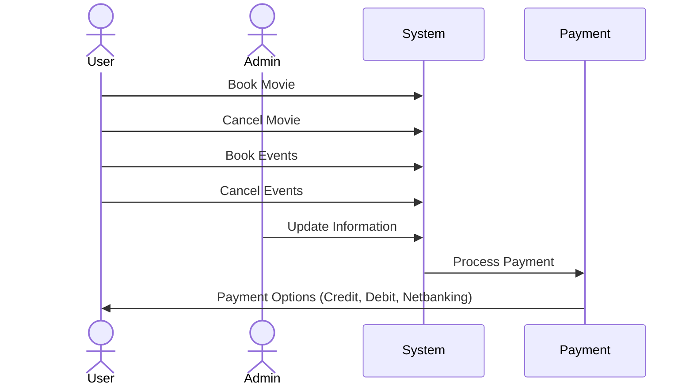
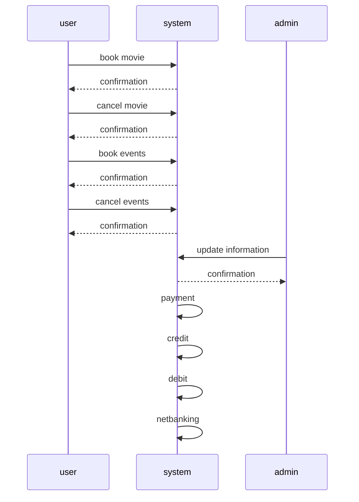
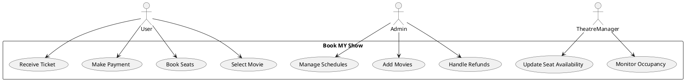

# Hello


```mermaid
 sequenceDiagram
     actor Actor
 ```
```plantuml
@startuml
actor User
actor Admin

User -> (Book Movie)
User -> (Cancel Movie)
User -> (Book Events)
User -> (Cancel Events)

Admin -> (Update Information)

(Book Movie) --> (System)
(Cancel Movie) --> (System)
(Book Events) --> (System)
(Cancel Events) --> (System)
(Admin) --> (System)

(System) --> (Payment)

(Payment) --> (Credit)
(Payment) --> (Debit)
(Payment) --> (Netbanking)
@enduml
```




# Detailed Cross-Reference Matrix for Book MY Show

## **Key Features**
- Movie selection
- Theatre and seat booking
- Payment gateway
- Ticket generation
- User reviews and ratings
- Notifications and reminders

---

## **Modules vs Features**

| Module                    | Movie Selection | Theatre/Seat Booking | Payment Gateway | Ticket Generation | Reviews/Ratings | Notifications |
|---------------------------|-----------------|-----------------------|-----------------|-------------------|-----------------|---------------|
| **User Module**           | ✅              | ✅                    | ✅              | ✅                | ✅              | ✅            |
| **Admin Module**          | ✅              | ✅                    | ✅              | ✅                | ❌              | ❌            |
| **Theatre Management**    | ❌              | ✅                    | ❌              | ✅                | ❌              | ✅            |
| **Payment System**        | ❌              | ❌                    | ✅              | ✅                | ❌              | ❌            |

---

## **Feature Details**
- **Movie Selection**
  - Users can browse through movies and view details (cast, genre, duration, trailer).
  - Filters: Genre, Language, Ratings.
  - Search by keywords or actors.

- **Theatre/Seat Booking**
  - Select theatre based on location and availability.
  - Interactive seat map for seat selection.
  - Dynamic pricing based on demand.

- **Payment Gateway**
  - Multiple payment options: Credit/Debit, UPI, Wallets.
  - Secure transactions with encryption.
  - Refunds in case of cancellation.

- **Ticket Generation**
  - E-tickets with QR codes for entry.
  - Ticket details: Movie, Time, Seat, and Theatre.
  - Option to download or email the ticket.

- **User Reviews and Ratings**
  - Leave reviews after watching a movie.
  - Rate movies on a scale of 1-5 stars.
  - View aggregate ratings and top reviews.

- **Notifications**
  - Reminders for upcoming bookings.
  - Promotions and offers.
  - Critical updates or changes to booking.

---

## **Detailed Workflows**

### **User Module**
- **Flow:**
  1. Browse movies.
  2. Select theatre and time.
  3. Book seats.
  4. Make payment.
  5. Receive ticket.
- **Error Handling:**
  - Invalid payment.
  - Booking conflicts.

### **Admin Module**
- **Flow:**
  1. Add/Edit movies.
  2. Manage theatres and schedules.
  3. Monitor transactions.
  4. Approve refunds.

### **Theatre Management**
- **Flow:**
  1. Upload seating layout.
  2. Update seat availability.
  3. Monitor seat occupancy.

---

## **Plant UML Diagram**



# ABC042/ARC058 Explanation
**Authors: Kazuma Mikami (kyuridenamida) / Kohei Morita (yosupo)**

## Problem A: Wafuu Iroha-chan Easy
It is possible to create a 5-7-5 structure if and only if there are two strings of length 5 and one string of length 7 among the given strings A, B, and C.

---

## Problem B: Iroha-chan Loves Strings Easy
Given that all strings have the same length \( L \), sorting the given strings lexicographically and concatenating them in that order achieves the lexicographically smallest result.

In general, even when string lengths differ, for two strings \( a \) and \( b \), define \( a \) as smaller than \( b \) if \( a + b < b + a \). Sorting strings based on this rule and concatenating them results in the lexicographically smallest string. The proof is omitted.

---

## Problem C: Iroha-chan the Perfectionist
Since it is guaranteed that {1, 2, 3, ..., 9} ∉ {D1, D2, ..., DN}, there are no cases where only 0 can be used, ensuring a solution always exists.

Even if there is only one type of usable digit, creating a number with \( N + 1 \) digits using that digit ensures the solution's upper limit is \( 10^N \). Checking \( N, N+1, N+2, \dots \) sequentially to find the smallest number meeting the conditions is sufficient.

The overall time complexity is \( O(N \log N) \).

---

## Problem D: Iroha-chan and Grids
The top-left coordinate is \((0, 0)\), and the bottom-right coordinate is \((H-1, W-1)\). 

For all \( B \leq i \leq W \), count the number of paths passing through \((0, 0), (H-A-1, i), (H-A, i), (H-1, W-1)\) and sum them up to find the total number of valid paths.

To efficiently compute the number of paths moving \( y \) times down and \( x \) times right, use \( C(x + y, x) \) (the number of combinations choosing \( x \) from \( x + y \)).

Precompute \( x! \mod (10^9 + 7) \) and \((x!)^{-1} \mod (10^9 + 7)\) for \( 0 \leq x \leq H + W - 2 \) in \( O(H + W) \). Since \( 10^9 + 7 \) is prime, we can compute modular inverses using Fermat’s Little Theorem: 
\[ x^{-1} \equiv x^{10^9+5} \pmod{10^9 + 7}. \]

Using fast exponentiation, compute the modular inverses efficiently.

---

## Problem E: Wafuu Iroha-chan
Count the number of sequences that do not contain \( XYZ \). Alternatively, counting sequences that do contain \( XYZ \) is also acceptable.

Use memoized depth-first search to determine values for each position in the sequence, ensuring \( XYZ \) does not appear. 

For \( XYZ = 575 \), the worst-case scenario uses the most values, requiring only the last 16 values to be stored. This reduces the state space to \( N \cdot 2^{16} \).

Using bit manipulation (16-bit integers) to represent sequences allows for efficient \( O(A \cdot N \cdot 2^{X+Y+Z}) \) computation.

---

## Problem F: Iroha-chan Loves Strings
Define \( dp[i][j] \) as the lexicographically smallest string using strings up to the \( i \)-th one to create a string of exactly length \( j \). \( dp[i][j] \) is undefined if strings beyond \( i \)-th cannot reach length \( K-j \).

Optimize the space complexity to \( O(NK) \) by storing only the common prefix of \( dp[i][j] \) and maintaining flags for validity. Compare strings efficiently using Longest Common Prefix (LCP) techniques with rolling hashes.

Precompute rolling hash values for substrings and use binary search to compute LCP in \( O(\log K) \). Further optimizations can reduce the complexity to \( O(NK) \).

Example for \( N = 5, K = 7 \):
- \( s1 = "aaaaaa" \)
- \( s2 = "abc" \)
- \( s3 = "xxxx" \)
- \( s4 = "ddd" \)
- \( s5 = "abcd" \)

**DP Table Updates**:
1. \( i = 0 \): \( dp[0][0] = "" \)
2. \( i = 1 \): \( dp[1][0] = "" \)
3. \( i = 2 \): \( dp[2][0] = "", dp[2][3] = "abc" \)
4. \( i = 3 \): \( dp[3][0] = "", dp[3][3] = "abc", dp[3][7] = "abcxxxx" \)
5. \( i = 4 \): \( dp[4][0] = "", dp[4][3] = "abc", dp[4][7] = "abcxxxx" \)
6. \( i = 5 \): \( dp[5][0] = "", dp[5][3] = "abc", dp[5][7] = "abcabcd" \)


