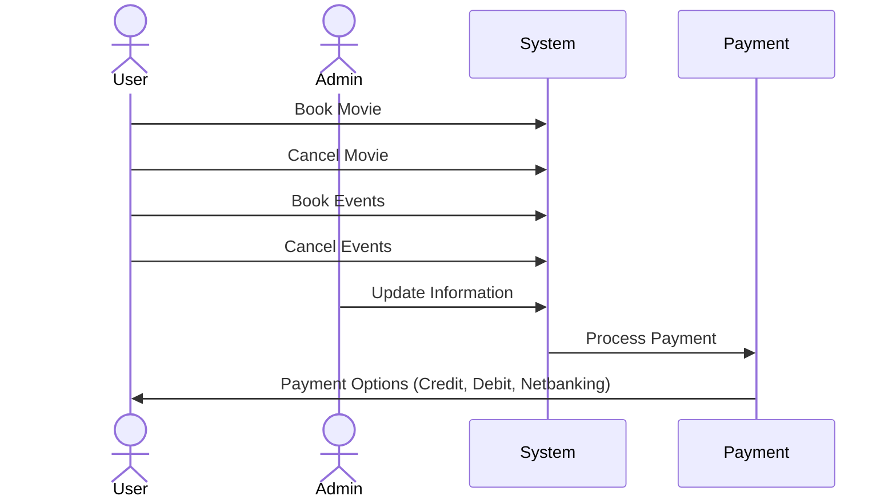
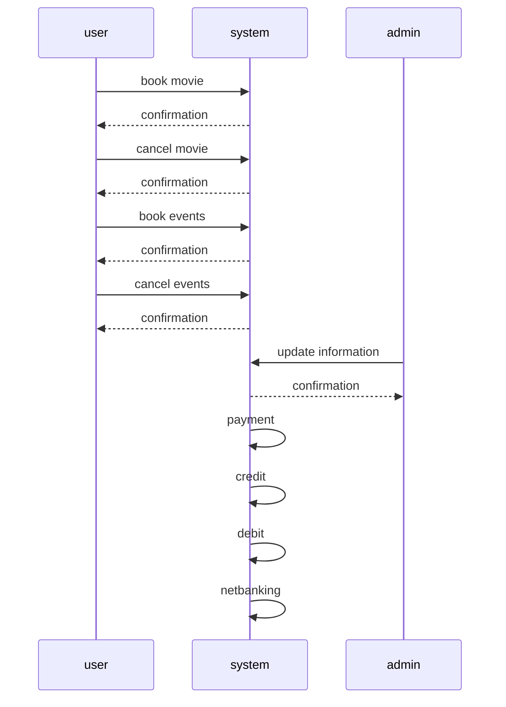

# Hello


```mermaid
 sequenceDiagram
     actor Actor
 ```
```plantuml
@startuml
actor User
actor Admin

User -> (Book Movie)
User -> (Cancel Movie)
User -> (Book Events)
User -> (Cancel Events)

Admin -> (Update Information)

(Book Movie) --> (System)
(Cancel Movie) --> (System)
(Book Events) --> (System)
(Cancel Events) --> (System)
(Admin) --> (System)

(System) --> (Payment)

(Payment) --> (Credit)
(Payment) --> (Debit)
(Payment) --> (Netbanking)
@enduml
```




# Detailed Cross-Reference Matrix for Book MY Show

## **Key Features**
- Movie selection
- Theatre and seat booking
- Payment gateway
- Ticket generation
- User reviews and ratings
- Notifications and reminders

---

## **Modules vs Features**

| Module                    | Movie Selection | Theatre/Seat Booking | Payment Gateway | Ticket Generation | Reviews/Ratings | Notifications |
|---------------------------|-----------------|-----------------------|-----------------|-------------------|-----------------|---------------|
| **User Module**           | ✅              | ✅                    | ✅              | ✅                | ✅              | ✅            |
| **Admin Module**          | ✅              | ✅                    | ✅              | ✅                | ❌              | ❌            |
| **Theatre Management**    | ❌              | ✅                    | ❌              | ✅                | ❌              | ✅            |
| **Payment System**        | ❌              | ❌                    | ✅              | ✅                | ❌              | ❌            |

---

## **Feature Details**
- **Movie Selection**
  - Users can browse through movies and view details (cast, genre, duration, trailer).
  - Filters: Genre, Language, Ratings.
  - Search by keywords or actors.

- **Theatre/Seat Booking**
  - Select theatre based on location and availability.
  - Interactive seat map for seat selection.
  - Dynamic pricing based on demand.

- **Payment Gateway**
  - Multiple payment options: Credit/Debit, UPI, Wallets.
  - Secure transactions with encryption.
  - Refunds in case of cancellation.

- **Ticket Generation**
  - E-tickets with QR codes for entry.
  - Ticket details: Movie, Time, Seat, and Theatre.
  - Option to download or email the ticket.

- **User Reviews and Ratings**
  - Leave reviews after watching a movie.
  - Rate movies on a scale of 1-5 stars.
  - View aggregate ratings and top reviews.

- **Notifications**
  - Reminders for upcoming bookings.
  - Promotions and offers.
  - Critical updates or changes to booking.

---

## **Detailed Workflows**

### **User Module**
- **Flow:**
  1. Browse movies.
  2. Select theatre and time.
  3. Book seats.
  4. Make payment.
  5. Receive ticket.
- **Error Handling:**
  - Invalid payment.
  - Booking conflicts.

### **Admin Module**
- **Flow:**
  1. Add/Edit movies.
  2. Manage theatres and schedules.
  3. Monitor transactions.
  4. Approve refunds.

### **Theatre Management**
- **Flow:**
  1. Upload seating layout.
  2. Update seat availability.
  3. Monitor seat occupancy.

---

## **Plant UML Diagram**

```plantuml
@startuml
actor User
actor Admin
actor TheatreManager

rectangle "Book MY Show" {
    User --> (Select Movie)
    User --> (Book Seats)
    User --> (Make Payment)
    User --> (Receive Ticket)

    Admin --> (Add Movies)
    Admin --> (Manage Schedules)
    Admin --> (Handle Refunds)

    TheatreManager --> (Update Seat Availability)
    TheatreManager --> (Monitor Occupancy)
}
@enduml

